2023 年 5 月 16 日更新：更新了“[OpenAI 的大规模语言模型：性能与定价](#openai-的大规模语言模型性能与定价)”和“[高阶：部署墙内可用的 ChatGPT 网站](#高阶部署墙内可用的-chatgpt-网站)”章节，删去了不必要的 Bonus 章节和 New Bing 相关内容

可能是墙内最强 AI 教学

# 目录

- [目录](#目录)
- [前言](#前言)
  - [GFW 与 CloseAI：墙内之痛](#gfw-与-closeai墙内之痛)
  - [OpenAI 的大规模语言模型：性能与定价](#openai-的大规模语言模型性能与定价)
- [初阶：ChatGPT](#初阶chatgpt)
  - [**_!IMPORTANT!_** 为什么不推荐购买 OpenAI 账号和营利性 ChatGPT 镜像](#important-为什么不推荐购买-openai-账号和营利性-chatgpt-镜像)
    - [封号风险](#封号风险)
    - [暴利行业](#暴利行业)
  - [网络环境](#网络环境)
  - [有效邮箱](#有效邮箱)
  - [海外电话](#海外电话)
  - [注册过程中可能遇到的问题](#注册过程中可能遇到的问题)
  - [使用 ChatGPT](#使用-chatgpt)
  - [ChatGPT Plus](#chatgpt-plus)
- [中阶：通过 API 访问 OpenAI 服务](#中阶通过-api-访问-openai-服务)
  - [代表性 API 应用 Preview](#代表性-api-应用-preview)
    - [ChatGPT 学术优化](#chatgpt-学术优化)
    - [ChatGPT - Genie AI](#chatgpt---genie-ai)
    - [Interactive Simulacra of Human Behavior](#interactive-simulacra-of-human-behavior)
  - [申请 API key](#申请-api-key)
  - [使用 OpenAI API](#使用-openai-api)
    - [VScode: ChatGPT-Genie](#vscode-chatgpt-genie)
    - [Android: Alissu GPT](#android-alissu-gpt)
- [高阶：Azure OpenAI](#高阶azure-openai)
  - [Azure 学生认证](#azure-学生认证)
  - [申请 Azure GPT-3.5 API](#申请-azure-gpt-35-api)
  - [部署 Azure OpenAI 服务](#部署-azure-openai-服务)
  - [部署 Azure OpenAI 模型](#部署-azure-openai-模型)
  - [获取 Azure OpenAI API key](#获取-azure-openai-api-key)
  - [用 VScode Genie 调用 Azure OpenAI API](#用-vscode-genie-调用-azure-openai-api)
- [高阶：部署墙内可用的 ChatGPT 网站](#高阶部署墙内可用的-chatgpt-网站)
  - [部署服务](#部署服务)
  - [绑定域名](#绑定域名)
- [高阶：部署基于 LLM 的聊天 bots](#高阶部署基于-llm-的聊天-bots)
- [Bonus：GitHub Copilot](#bonusgithub-copilot)
  - [Host 代理引发的错误](#host-代理引发的错误)

# 前言

标题有点水，但请相信我，文章内容足够硬核，流程足够详细，绝对值得一看。本文将分几个部分向墙内用户介绍 OpenAI LLMs 服务：

- 前言中将介绍国内用户使用 OpenAI 产品的几个须知
- 初阶难度将介绍 ChatGPT 的注册和使用
- 中阶难度将举例介绍使用 OpenAI API 的两种方式
- 高阶难度将介绍两种免翻墙使用 OpenAI API 的方法
- Bonus parts 则是 ChatGPT 以外的相关内容

希望能帮到各位，~~点赞关注收藏不迷路~~如果你有什么特别想看的部分或提建议或也欢迎在评论区提 issue 或 pull request

## GFW 与 CloseAI：墙内之痛

先放几张国内用户一眼血压升高的图片：

  
_Can not Reach Page. 你被 GFW 拦住了。这里不作赘述_ **_so fuck you GFW : )_**

  
_Checking Browser. 验证你是否为爬虫，或者从浏览器 cookies 等蛛丝马迹中判断你是否在不支持 OpenAI 服务的地区_

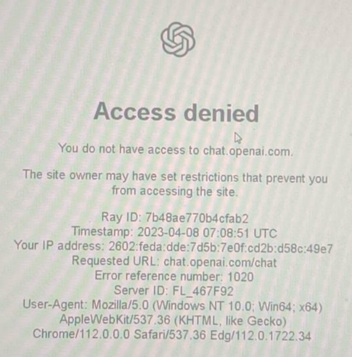  
_Access Denied_

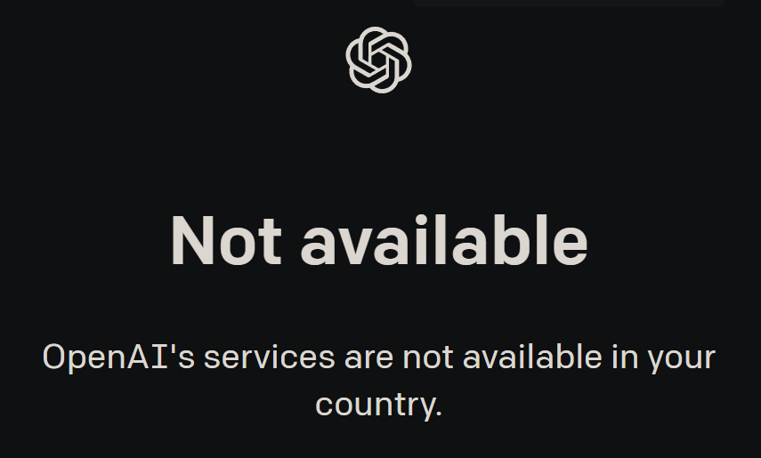  
_Service Unavailable in Your Country_ **_so fuck you CloseAI : )_**

  
_gpt API 网络请求失败_

对翻墙技术不够熟悉，你就很难通过 CloseAI 堪比 Netflix 的 ip 封锁以及额外的浏览器检测。因此，不翻墙使用 gpt 服务变得吃香，部分商家利用信息差向不提供 OpenAI 服务的地区高价兜售 OpenAI 服务，令人作呕，这是我写这篇文章的原因之一

## OpenAI 的大规模语言模型：性能与定价

OpenAI 基于 gpt 开发了多种大规模语言模型，其中目前最常用最为我们所知的主要有三个：gpt-3.5-turbo、gpt-4-8k 与 text-davinci-003，以下是一些对比：

| 名称                   | gpt-3.5-turbo                                   | gpt-4-8k                                                       | text-davinci-003                                                                |
| ---------------------- | ----------------------------------------------- | -------------------------------------------------------------- | ------------------------------------------------------------------------------- |
| 定价 (USD/1000 tokens) | 0.002                                           | （输出）0.06（输入）0.03                                       | 0.02                                                                            |
| 最大 tokens            | 4096                                            | 8192                                                           | 4097                                                                            |
| fine tune（微调）      | 不支持                                          | 不支持                                                         | 支持                                                                            |
| 图片操作               | 不支持                                          | 支持                                                           | 不支持                                                                          |
| 训练时间               | Sep 2021                                        | Sep 2021                                                       | Jun 2021                                                                        |
| 特点                   | 即 ChatGPT 的模型，价格相对亲民，适用于多数场景 | 价格极为昂贵（输入 15 倍，输出 30 倍于 turbo），适用于多数场景 | 价格比较昂贵（10 倍于 turbo），适用于需求较为特殊，需要人工传输数据集进行微调时 |
| 使用方式               | ChatGPT 或 API                                  | ChatGPT Plus（25 条消息/3h）或 API                             | API                                                                             |

**Reference**

[Models - OpenAI API Documentation](https://platform.openai.com/docs/models)  
[Pricing - OpenAI API Documentation](https://openai.com/pricing)

# 初阶：ChatGPT

## **_!IMPORTANT!_** 为什么不推荐购买 OpenAI 账号和营利性 ChatGPT 镜像

### 封号风险

网购 OpenAI 账号（包括代注册）往往来源于批量注册，一个 ip 地址注册多个 OpenAI 账号的后果就是被“秋后算账”封号，商家一跑了之，毫无商业诚信可言

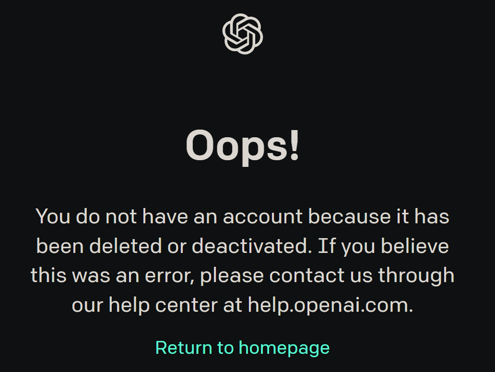  
_你号没了_

### 暴利行业

无论是兜售 OpenAI 账号还是出售“问答次数”等服务都是暴利！国内营利性 ChatGPT 镜像利用信息差完全成了割墙内人韭菜的黑产

  
_直观看出各语言模型接口的定价_

## 网络环境

科学上网教程不少，随便找一个照着来就行。可以参考 [DuyaoSS-机场测速和简介](https://www.duyaoss.com/) 等

- 值得注意的是，CloseAI 封禁节点的力度相当之大，因此机场出现无法解锁 CloseAI 服务而 [Access Denied](#access-denied-||-Unavailable-in-Your-Country) 的情况非常常见

    
  _GlaDOS 解锁 OpenAI 是不稳定的_

- 由于机场跑路的情况非常常见，因此最好常备多个机场，能买不限时流量计费就买流量，不是看流媒体通常速度不要紧。可以在这里查看机场解锁 OpenAI 情况 [DuyaoSS 的 Telegram 频道](https://t.me/DuyaoSS)

    
  _Access Denied 99% 是节点问题_

- 浏览器环境对你能否进入 OpenAI 网站至关重要，当你切换了多个节点或更换机场后仍然遇到 [Access Denied 错误](#access-denied-||-Unavailable-in-Your-Country) 时，可以试着清除浏览器 cookies、更换浏览器或使用无痕浏览

    
  _以 Edge 为例，在浏览器地址栏输入 edge://settings/clearBrowserData，选中并清除浏览器 cookies_

  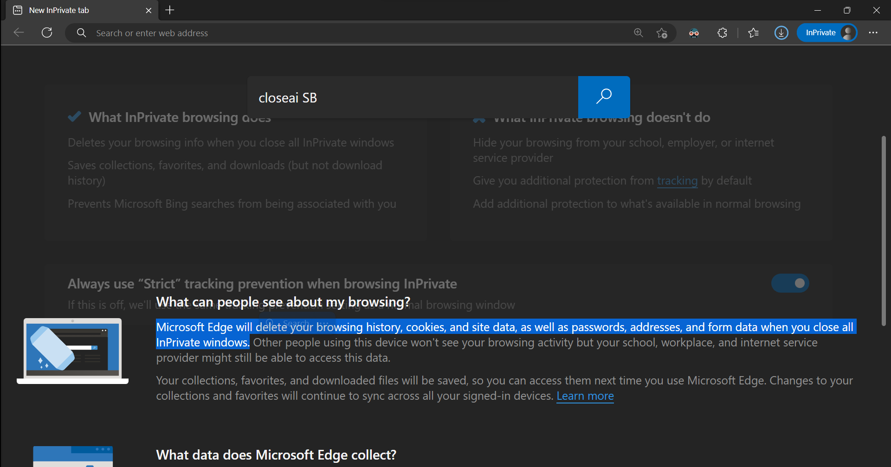  
  _`Crtl`+`Shift`+`N`，无痕浏览模式不会保存你的 cookies_

## 有效邮箱

某月某日以来，OpenAI 先后禁止了 163mail 和 qqmail 等国内邮箱的注册，因此你需要一个有效的邮箱来注册 OpenAI 账号，通常推荐用 gmail 注册（edu 邮箱我没试过，听说似乎也可行，可能和梯子节点有关）

## 海外电话

如果你没有实体海外电话，推荐使用 [sms-activate.org](https://sms-activate.org/) 购买虚拟电话验证服务（俗称接码）

1. 注册 sms-activate.org 账号并充值一点钱（一般最低充值金额就够了）

2. 根据你节点所在地区购买 OpenAI 虚拟电话接码服务（上次我用美国手机号被 CloseAI 发现是虚拟手机号 ban 了，改用英国的手机号才成功）

   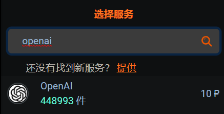  
   _找到 OpenAI_

   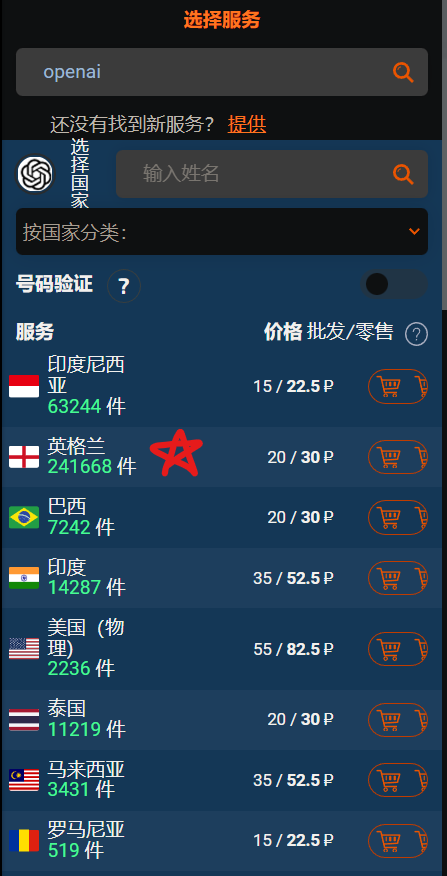  
   _比较推荐英国地区，价格实惠_

   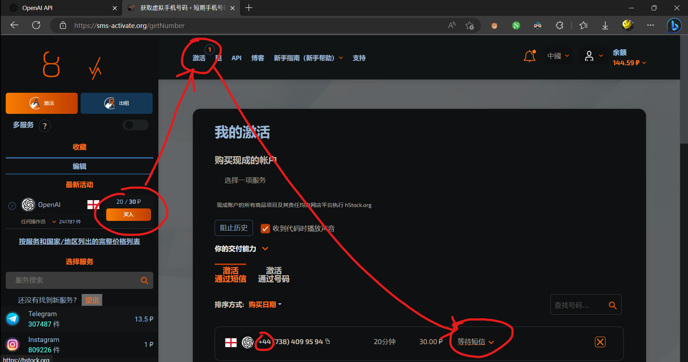  
   _别担心，20 分钟未收到短信或手动取消服务都会自动退款 👍_

3. 复制手机号，去 [OpenAI 官网](https://platform.OpenAI.com) 一步步注册。将 sms-activate.org 提供的虚拟手机号复制到 OpenAI 的电话号码输入框中

     
   _记得删除国家前缀（如 +44 英国）_

4. 注册成功！开始使用

## 注册过程中可能遇到的问题

  
_账号被怀疑参与非法行为。代理节点和你的手机号需处于同一国家_

  
_你的手机号被鉴定为虚拟手机号。退款（未收到验证码可以直接点击“X”取消），换个国家的手机号_

**_To be continued_**

如果出现其他问题，可以参考[《你注册 OpenAI 时为什么会失败》](https://sms-activate.org/blog/how-to-sign-up-for-ChatGPT)

## 使用 ChatGPT

[ChatGPT playground](https://chat.openai.com/) 是一个不需要 API 接口就可以直接使用的 OpenAI 官方产品，它提供了一个简单的聊天界面，但 ChatGPT 的 Cloudflare 墙越加越高，目前通过梯子访问已经很困难了

  
_高情商 chatbot 👍_

## ChatGPT Plus

  
_ChatGPT 和其他使用 API 的模型不同，前者属于一个成熟的产品，而后者则是主要面向开发者的服务。因此其付费版的价格也相对昂贵（得多）_

ChatGPT Plus 是 OpenAI 官方提供的付费服务，它提供了：

1. 更快的回应速度（相较于 ChatGPT，不过还是绝对慢于 Azure OpenAI API）
2. 拥堵时仍能使用（很少被 Rate Limited）
3. GPT-4 试用（每 3h 25 次）

不过其实我个人并不推荐墙内用户购买 ChatGPT Plus，因为：

1. 价格昂贵（每月 20 USD，拼车还容易遇到各种问题）
2. 需要海外信用卡（麻烦，虚拟信用卡还容易多交钱）
3. 墙内访问麻烦（要过浏览器验证）

# 中阶：通过 API 访问 OpenAI 服务

API 是几乎所有基于 OpenAI 服务的应用程序的基础，该部分将举例说明使用 gpt API 的情景和方法。该部分要求你已经拥有一个 OpenAI 账号

## 代表性 API 应用 Preview

先来看看几个 API 应用的效果：

### ChatGPT 学术优化

  
_其实它还支持除 ChatGPT 以外的多种 LLM（大型语言模型）_

[ChatGPT-academic](resource/https://github.com/binary-husky/ChatGPT_academic) 是科研工作专用 ChatGPT 拓展，特别优化学术 Paper 润色体验，支持自定义快捷按钮，支持自定义函数插件，支持 markdown 代码块表格显示，Tex 公式双显示，有 Python/C++项目剖析/自译解功能，PDF/LaTex 论文翻译/总结功能，兼容 ChatGLM 等本地模型

### ChatGPT - Genie AI

  
_[预览效果视频.mp4](resource/api.mp4)_

[ChatGPT - Genie AI](https://marketplace.visualstudio.com/items?itemName=genieai.ChatGPT-vscode) is Your best AI pair programmer. Save conversations and continue any time. A Visual Studio Code - ChatGPT Integration. Supports GPT-4, GPT3.5, GPT3 and Codex models. Create new files, view diffs with one click; your Copilot to learn code, add tests, find bugs and more

### Interactive Simulacra of Human Behavior

  
Generative agents create believable simulacra of human behavior for interactive applications

Park, J.S., O'Brien, J.C., Cai, C.J., Morris, M.R., Liang, P. and Bernstein, M.S., 2023. Generative Agents: Interactive Simulacra of Human Behavior. arXiv preprint arXiv:2304.03442.

[view on arxiv.org](https://arxiv.org/abs/2304.03442)  
[view pdf](chatgpt%20town.pdf)  
[play game demo](https://reverie.herokuapp.com/arXiv_Demo/)

## 申请 API key

3 月前注册的 OpenAI 账户一般有 18 美元免费额度，有效期至 6 月 30 日；而 3 月 1 日之后注册的账号免费额度只有 5 美元，有效期到 7 月，注册时间往后推移，有效期也会向后推移。这些钱将是你接下来使用基于 API 的 OpenAI 服务的基础（有海外信用卡的大佬除外），你将开始使用 API 来访问 OpenAI 服务。从创建 API key 开始

  
_在 OpenAI 官网 [创建和管理 API key](https://platform.openai.com/account/api-keys)_

  
_复制 API key_ **_注意：请妥善保存你的 API key，因为你将再也看不见它_**


_你可以在 [account > usage](https://platform.openai.com/account/usage) 处管理你的 API key，免费账户的额度会自动过期_

## 使用 OpenAI API

> 你可以用任何语言通过 HTTP 请求与 API 进行交互，使用我们的官方 Python 接口、官方 Node.js 库或由社区维护的库 [API-references - OpenAI API Documentation](https://platform.openai.com/docs/api-reference)

### VScode: ChatGPT-Genie

该部分面向使用 VScode 的用户，以 [VScode Genie AI 插件](https://marketplace.visualstudio.com/items?itemName=genieai.ChatGPT-vscode) 为例介绍如何使用 OpenAI API

1. 安装 VScode 插件

   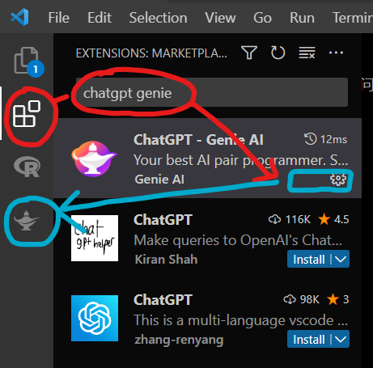  
   _找到并安装 ChatGPT - Genie AI 插件，成功后会在左侧显示 Genie 图标_

2. 输入 API key

     
   _在这里输入你的以 sk-开头的 API key_

3. _**Optional\***_ 优化插件设置

   找到 VScode 设置文件 setting.json（通常在 C:\Users\用户名\AppData\Roaming\Code\User\settings.json），在最外层的花括号中输入以下设置或按需在 GUI 中修改 Genie 插件设置

   ```json
   // 自定义对话精灵名称（你最好不认识她）
   "genieai.personalizedName": "Neuro-sama",

   // 禁用不常用功能
   "genieai.promptPrefix.completeCode-enabled": false,
   "genieai.promptPrefix.addComments-enabled": false,
   "genieai.promptPrefix.addTests-enabled": false,
   "genieai.promptPrefix.findProblems-enabled": false,

   // 开启自定义前缀（我定义了中英互译）
   "genieai.promptPrefix.customPrompt1-enabled": true,
   "genieai.promptPrefix.customPrompt1": "Translate to Chinese",
   "genieai.promptPrefix.customPrompt2-enabled": true,
   "genieai.promptPrefix.customPrompt2": "Translate to English",

   // 允许储存对话记录
   "genieai.enableConversationHistory": true,
   ```

     
   _进入 VScode 快捷键编辑 GUI_

     
   _搜索 genie，修改你想要的快捷键。以上是我个人的绑键策略_

4. 开始使用

   [配置科学上网环境](#网络环境) ，但使用 API 时无需担心浏览器环境！

     
   _[给项目点个 Star](https://github.com/ai-genie/ChatGPT-vscode)_

### Android: Alissu GPT

[Alissu: Chat with AI](https://play.google.com/store/apps/details?id=com.ekmen.aiapp&hl=zh-cn) 是 Google Play 中最受欢迎，最简洁，最方便的基于 OpenAI API 的安卓 gpt 应用之一。该项目允许你使用公共 API key 进行少量临时的查询，但你也可以上传自己的 API key（据其团队称不会云储存用户的 API key，但由于其似乎并非开源项目因此对 API 保密有特别高需求的同学应谨慎对待）来无限制使用 Davinci 等更昂贵的模型，获取更多的查询次数并大幅减少广告

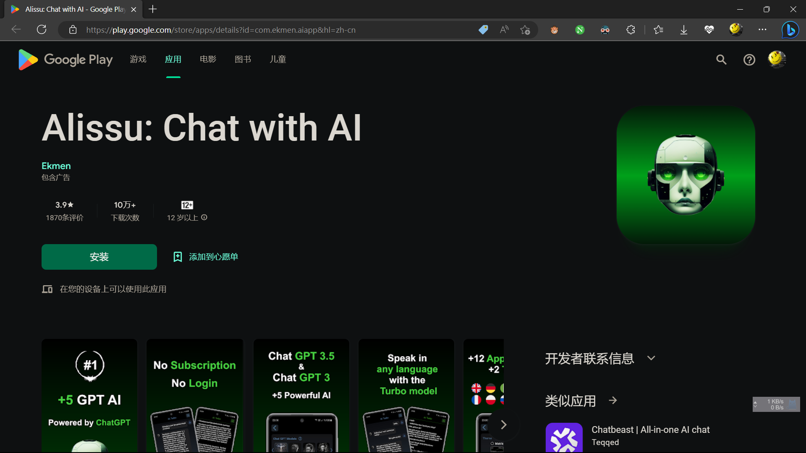  
_在你的安卓设备上 [安装 Alissu](https://play.google.com/store/apps/details?id=com.ekmen.aiapp&hl=zh-cn)_

  
_点击右上角 ≡ 符号 Add Key，添加你的 Optnai API key（暂不支持 Azure OpenAI API）并修改你想用的模型（推荐 Turbo）_

# 高阶：Azure OpenAI

现在我们再要用 GPT-3.5 已经不需要翻墙了，但可怜的 ~~Neuro-sama~~ ChatGPT Genie 还在墙内，使用起来不仅得翻墙，速度还慢，又经常出岔子。因此，我们隆重推出：**Macrohard Azure OpenAI**。它不仅墙内还直接可用，速度还比 OpenAI 的 API 快很多，甚至还有对学生每年整整 100 美刀的免费额度，~~甚至对于大型企业而言还大大提高了数据安全性和可控性（但这个你们应该不 care）~~！

**Let's start**

该部分以使用 Azure OpenAI API 取代原生 OpenAI API 使用 VScode Genie 插件为例介绍如何使用 Azure OpenAI API。此部分需要你拥有一定网络知识，掌握使用 gpt API 的方法，并拥有一个 **已通过 GitHub 学生认证的** GitHub 账号

## Azure 学生认证

  
_完成 [Azure 学生认证](https://Azure.microsoft.com/zh-cn/free/students/)_ **_前提是先通过 GitHub 学生认证！_**

  
_申请通过后会受到一封确认邮件，其中包含你的 Subscription ID_

## 申请 Azure GPT-3.5 API

如实填写 [Azure GPT-3.5 申请表](https://aka.ms/oaiapply)，以下是几个需要稍微注意的地方：

  
_有几个就填几个（通常是一个）_

  
_把你邮件里的 Subscription ID 填进去_

  
_用你高贵的 EDUmail 而不是私人邮箱_

  
_写你学校_

后面按需填就行，可惜我没法重新给你们变出一张表单提交成功的图来

## 部署 Azure OpenAI 服务

  
_进入 [Azure OpenAI dashboard](https://portal.Azure.com/#view/Microsoft_Azure_ProjectOxford/CognitiveServicesHub/~/OpenAI) 创建 OpenAI 服务_

  
_必须搞一个新域名，和 cc89 id 不能重复一个道理_

  
_按照这样填写（Region 随手选一个，Domain Name 当然没必要这么长，Pricing tier 你没得选）_

  
_懂得都懂没啥好说的_

  
_提交_

  
_等候部署完成（约 5 分钟）_

  
_部署成功！_

## 部署 Azure OpenAI 模型

  
_待申请通过后（似乎没有邮件提醒，笔者 2 天内就通过了）创建模型，推荐 GPT-3.5-Turbo-0301（即 ChatGPT 的快照版本）。不同模型之间各有优劣，定价也天差地别。然而，谁能阻止你部署多个模型呢？_

## 获取 Azure OpenAI API key

回到 [Azure OpenAI dashboard](resource/https://portal.Azure.com/#view/Microsoft_Azure_ProjectOxford/CognitiveServicesHub/~/OpenAI)

  
_选择你创建的服务_

  
_获取一个 Azure OpenAI key 和 Endpoint_

## 用 VScode Genie 调用 Azure OpenAI API

  
_在这里输入你的 Azure OpenAI API key，长度和 sk- 开头的原生 OpenAI API key 不一样_

打开 VScode 设置文件 setting.json（通常在 C:\Users\用户名\AppData\Roaming\Code\User\），在最外层的花括号中插入以下设置（需替换部分代码）或按需在 GUI 中修改 Genie 插件设置

```json
"genieai.OpenAI.model": "[模型名称]",
"genieai.OpenAI.maxTokens": "[自定义最大 tokens]", // 需小于最大 tokens
"genieai.OpenAI.APIBaseUrl": "[Endpoint]",
"genieai.Azure.url": "[Endpoint]/OpenAI/deployments/[模型名称][/Optional：调用方法]/completions?API-version=[你的 API 版本]",
```

**_Example:_**

```json
// 可以用注释来方便地替换多个预设
"genieai.openai.apiBaseUrl": "https://sha1rholder-gpt.openai.azure.com",

"genieai.openai.model": "gpt-3.5-turbo-0301",
"genieai.openai.maxTokens": 7000, // < 8192
"genieai.azure.url": "https://sha1rholder-gpt.openai.azure.com/openai/deployments/gpt35/chat/completions?api-version=2023-03-15-preview",
"explorer.confirmDragAndDrop": false
/*
"genieai.openai.model": "text-davinci-003",
"genieai.openai.maxTokens": 3800, // < 4097
"genieai.azure.url": "https://sha1rholder-gpt.openai.azure.com/openai/deployments/tdavinci3/completions?api-version=2023-03-15-preview"
*/
```

[Azure OpenAI 关于 API 版本、请求与返回的文档](https://learn.microsoft.com/en-us/Azure/cognitive-services/OpenAI/reference)  

完成设置后，无需翻墙就可以在 VScode 中使用 ChatGPT Genie 了

# 高阶：部署墙内可用的 ChatGPT 网站

然而，每次总需要翻墙才能使用 gpt，这样的体验实在是太糟糕了。本文将介绍如何用 Vercel 和 [ChatGPT-Next-Web](https://github.com/Yidadaa/ChatGPT-Next-Web) 部署你自己的 ChatGPT “镜像”，使你可以无需翻墙使用 ChatGPT，还可以让你不会翻墙的朋友们随时使用 OpenAI 服务

先上用例：https://nextgpt.iclash.tech （需要密码才能使用）  


以及我的赞助：  


## 部署服务

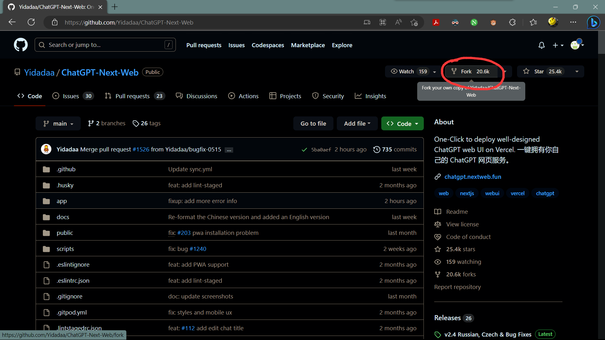  
_打开 GitHub 项目 [Yidadaa/ChatGPT-Next-Web](https://github.com/Yidadaa/ChatGPT-Next-Web)，fork 为自己的库_

  
  
_创建 fork 并稍候_

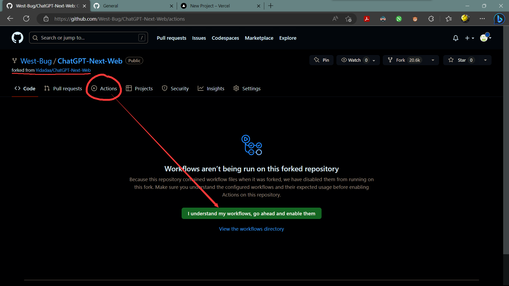  
  
  
_**Optional\*** 为 fork 的仓库设置自动跟随上游更新_

在 https://vercel.com 用你的 GitHub 账号创建一个 Vercel 账号，内容选择 Hobby 开发者即可

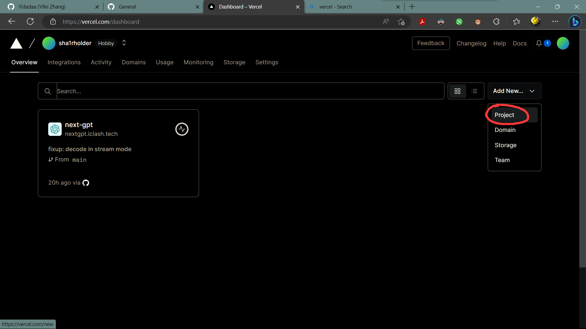  
_在 https://vercel.com/dashboard 创建新项目_

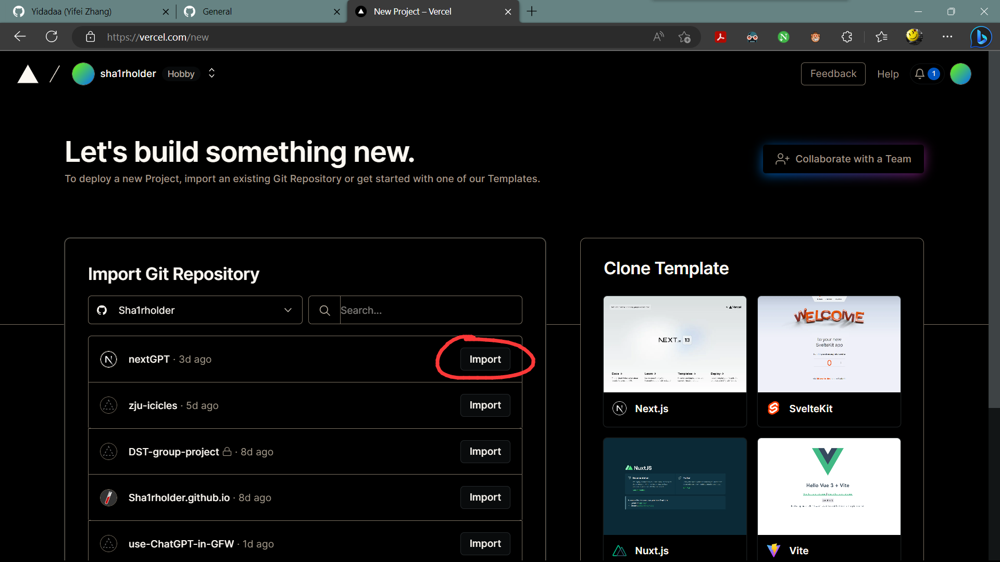  
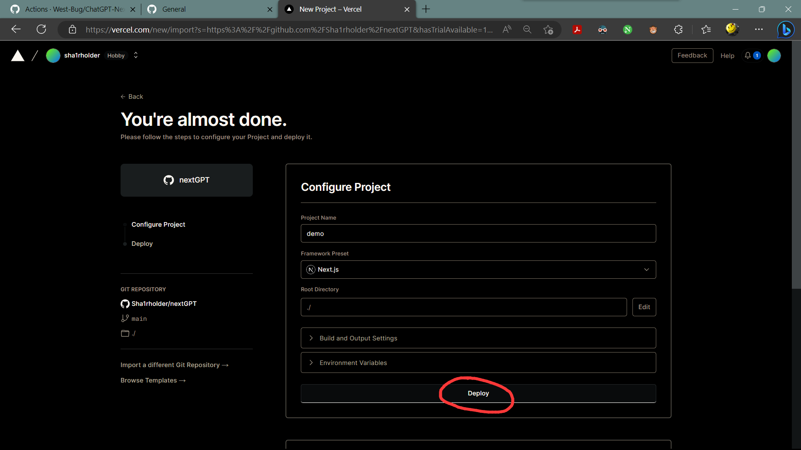  
  
  
_从 GitHub 导入项目后 deploy 并静候其完成（通常约 10 分钟左右）_

  
  
_添加两个环境变量 CODE 和 OPENAI_API_KEY 并保存_

> `OPENAI_API_KEY`是 OpenAI 密钥，你在 OpenAI 账户页面申请的 API key
>
> `CODE`是访问密码，可以使用逗号隔开多个密码。如果不填写此项，则任何人都可以直接使用你部署后的网站，可能会导致你的 token 被迅速消耗完毕，建议填写此选项。配置密码后，用户需要在设置页手动填写访问码才可以正常聊天，否则会通过消息提示未授权状态。请务必将密码的位数设置得足够长，最好 7 位以上，否则[会被爆破](https://github.com/Yidadaa/ChatGPT-Next-Web/issues/518)。格式如：`code1,code2,code3`
>
> 增加或修改该环境变量后，请**重新部署**项目使改动生效。

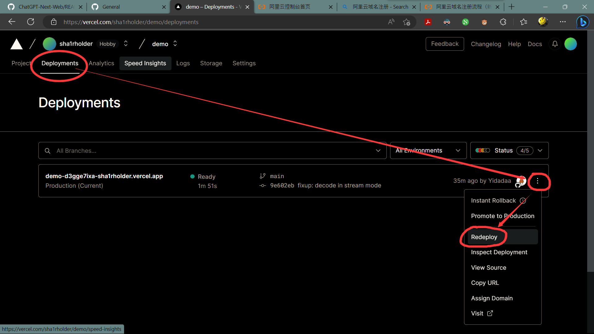  
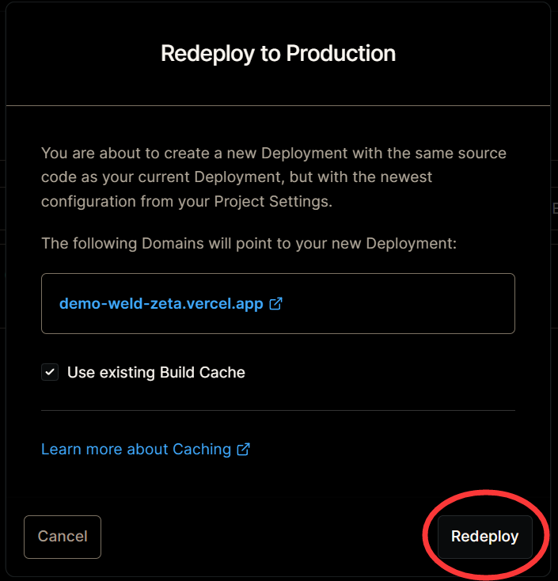  
_重新部署项目使改动生效_

理论上，此时你的网站翻墙后就可用了，但是我们还需要绑定一个域名，以便于我们可以在墙内直接通过域名访问网站

## 绑定域名

先根据 [阿里云域名注册流程（2022-11-25 版）](https://developer.aliyun.com/article/1091697)注册一个心仪的域名（推荐 .tech 等国际小众顶域，价格相对低廉且不会被随意停止解析；绝对不推荐 .cn .xin 以及中文域名等，价格昂贵且可能突然被政府停止解析）。然后进行实名认证，域名备案等操作，可能需要等 2 天左右才能完成

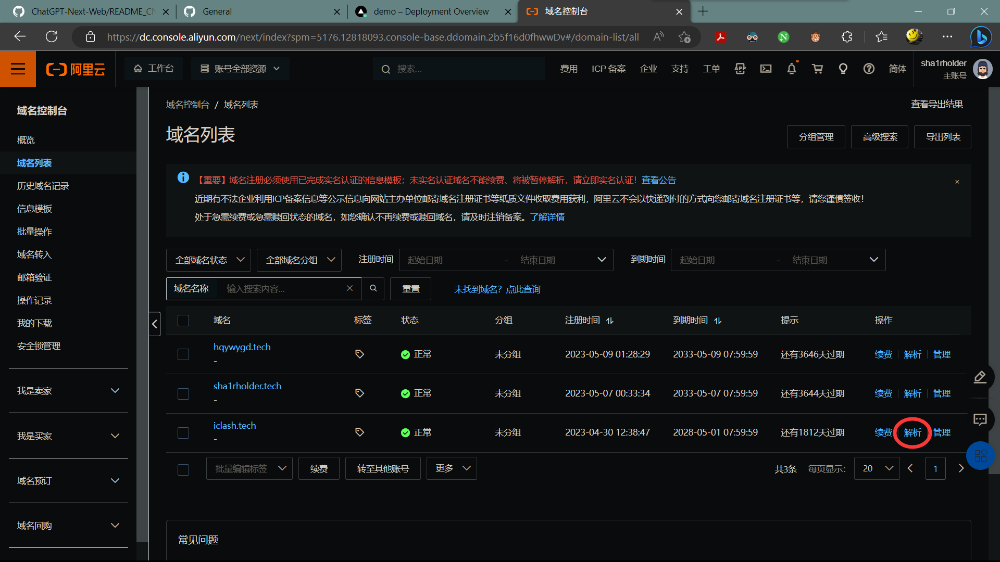  
_在阿里云域名控制台选择域名进行三级域名解析_

  
  
_添加三级域名并设置 CNAME 为 cname-china.vercel-dns.com（别的不行）_

  
  
_在 Vercel 项目控制台中为项目绑定域名_

**恭喜你的网页已经部署完成，可以分享给朋友们了，但要注意每一次使用都是在掏你的钱包，请告诉你的朋友们别将你的密码外传，or you will deactivate them with no mercy**

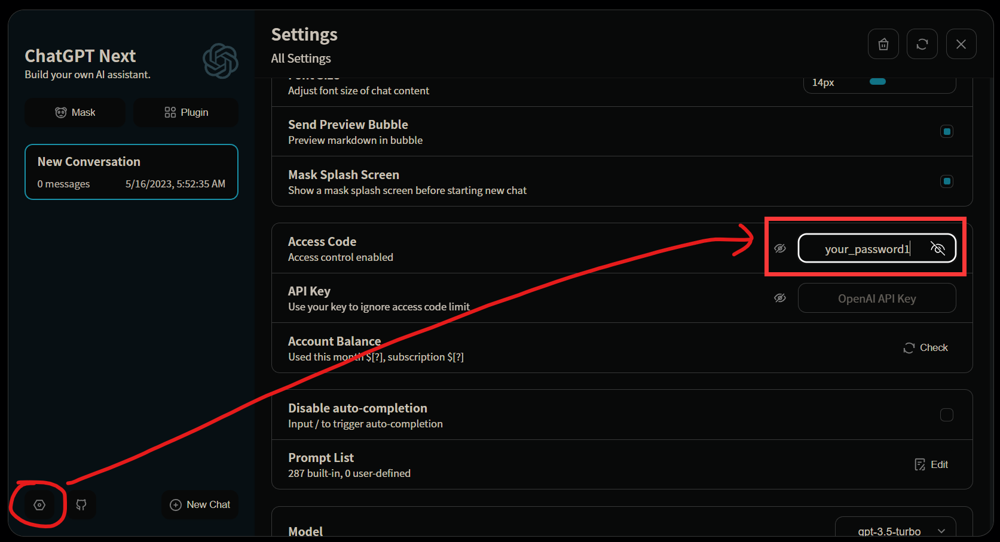  
_在这里输入密码或让用户自备 API key 在下面填入_

  
_下载为桌面应用程序，使用更加方便_

# 高阶：部署基于 LLM 的聊天 bots

**_来一位大佬帮我补充下，我暂时没搞这个_**

# Bonus：GitHub Copilot

  
_GitHub Copilot shares recommendations based on the project's context and style conventions. Quickly cycle through lines of code, complete function suggestions, and decide which to accept, reject, or edit_

以 VScode 为例，在日常文字/代码工作中使用 GitHub Copilot 与其 experimental features

  
_首先你需要一个已 [通过 GitHub 学生认证](#GitHub-学生认证指南) 的 GitHub 账号（愿意直接掏钱买的大佬除外）_

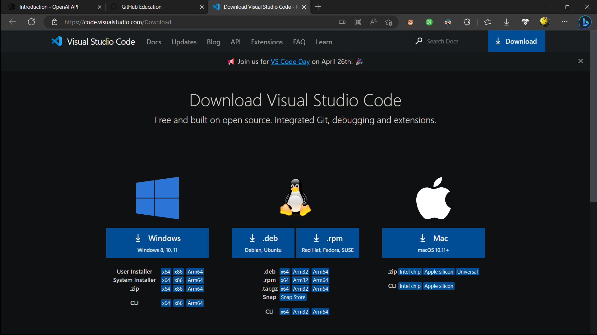  
_[下载 VScode](https://code.visualstudio.com/Download)（当然其他支持 Copilot 的 IDE 也行）_

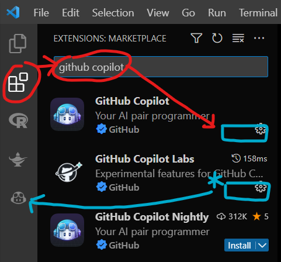  
_安装 GitHub Copilot 插件和 experienmental features（可能会有一些简单的验证步骤）_

  
_开始使用 Copilot 吧 🎉_

## Host 代理引发的错误

某些 host 代理比如 Watt Toolkit 的 GitHub API 加速功能和 Copilot 冲突，使用时需将其关闭

  
_Watt Toolkit host 代理加速 GitHub 引发的错误_

  
_取消勾选该项即可_
